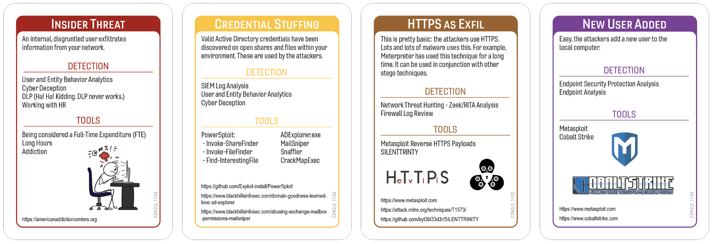

# The Call Came from Inside the Network
### Author: Ean Meyer - Black Hills Information Security
#### Campaign Template v1 - Campaign Version - 1.0

On January 11th, 2021 Ubiquiti, a large IT networking vendor, announced they were aware of an unauthorized disclosure of customer data. This breach became one of the more interesting incident response stories of the year. Early portions of the investigation revealed sensitive data was downloaded from Ubiquiti cloud servers, specifically AWS and GitHub resources. The attacker then attempted to extort the organization demanding $2 million USD in blackmail to not release the data. The attempt at extortion failed, but the breach was only just getting interesting. 

The attacker was actually an insider by the name of Nikolas Sharp. Sharp had access to all the cloud resources in question and was part of the Incident Response team. During investigation of the incident Sharp actively modified logs and shifted focus to other areas of the investigation to hide their actions. Once it became clear the extortion attempt would not work they took a different approach, that of whistleblower. Sharp sent emails to media and regulatory agencies describing a cover-up of a massive breach at Ubiquiti. Ubiquiti lost billions in market value as the news of a catastrophic breach spread across media platforms. 

Ubiquiti and the FBI completed their investigation and found Sharp at the center of the entire incident. Sharp was undone by an Internet hiccup that disconnected his VPN and briefly exposed his home IP. This allowed law enforcement to proceed with a warrant and arrest Sharp. On February 2nd, 2023 Sharp pled guilty to computer crimes related to the incident. Sharp will be sentenced on May 10th, 2023 with a possible maximum sentence of 37 years in prison. 

Ubiquiti was faced with an attacker on the inside, who had knowledge of their systems and processes, trusted access to their cloud environment, and a seat on the Incident Response Team where they could actively manipulate evidence to conceal their crimes. 

Is your organization ready for an attack like this? Let's find out!

## Tags
Core Deck, Insider Threat, Cloud, Media Crisis

## Compatible Decks
Core v2.2

## Scenarios

### Initial Compromise

*Insider Threat*

The Ubiquiti breach was caused by an Insider Threat. Nikolas Sharp was part of the Ubiquiti Cloud team. They had privileged access to the AWS and GitHub cloud environments at Ubiquiti.

### Pivot & Escalate

*Credential Stuffing*

We don't have the full details of the breach, but we do know that Nikolas Sharp used their existing privileged access to steal data. Credential Stuffing was chosen for Pivot & Escalate in this scenario as it describes the use of known Active Directory credentials to access services. Ubiquiti may be using authentication to AWS and GitHub based on their Directory Services through SAML/SSO or another Federated authentication procedure. In this case, it could be a Credential Stuffing attack of one credential, Nikolas Sparks account. However, it's much more likely they used service account credentials they had access to as part of their work to either authenticate to other service or to perform the actions needed to steal the data. Without the detailed breach report it's impossible to say definitively, but this is an extremely common Insider Threat attack vector. 

### C2 & Exfil

*HTTPS as Exfil*

During the Ubiquiti breach Nikolas Sparks used his existing privileged cloud access (or accounts he gained access to) to download sensitive information. This would most likely been done via some HTTPS method. 

### Persistence

*New User Added*

We don't have the full details of the breach, but we do know that Nikolas Sharp would have maintained the ability to add new users into the cloud environment. The Ubiquiti breach is interesting because Nikolas was the attacker and the incident responder. They didn't need to maintain access as they were already a trusted user. However, it would be a standard strategy for an insider threat to create additional accounts they can leverage later to avoid discovery or to re-enter the environment if their access was removed. 

## Procedures that Reveal the Attack Chain
The below Procedure Cards will reveal part of the attack chain in this scenario. This section can be used by the Incident Captain to quickly check if the card played would discover part of the attack chain. 

* UEBA (User and Entity Behavior Analytics)
	* Initial Compromise - Insider Threat
	* Pivot & Escalate - Credential Stuffing
* Cyber Deception
	* Initial Compromise - Insider Threat
	* Pivot & Escalate - Credential Stuffing
* SIEM Log Analysis
	* Pivot & Escalate - Credential Stuffing
* Network Threat Hunting
	* C2 & Exfil - HTTPS as Exfil
* Firewall Log Review
	* C2 & Exfil - HTTPS as Exfil
* Endpoint Protection Analysis
	* Persistence - New User Added
* Endpoint Security Protection Analysis
	* Persistence - New User Added

## Written Procedures
Below are the four written procedures the team playing will receive as part of the incident. These were chosen because they were specifically referenced in some public disclosure about the breach this campaign was based on. If there isn't any known reference to procedures used during the incident the campaign is based on two procedure cards that will discover some part of the attack chain will be chosen and two procedures that will not discover some part of the attack chain were chosen. For this campaign the below procedures will receive the +3 bonus per roll. As a general rule in campaign scenarios we select two established procedures that will discover part of the attack chain and two that will not for the +3 bonus.  

* Firewall Review
	* This was included because it will discover the C2 & Exfil for this campaign. It was also chosen because during the Ubiquiti breach the attacker was discovered because their VPN dropped and the IP of their home address was revealed. That type of connection would be logged on the firewall. 
* Network Threat Hunting - Zeek/RITA Analysis
	* This was included because it will discover the C2 & Exfil for this campaign. It was also chosen because during the Ubiquiti breach Nikolas Sharp, the insider threat, was modifying log files as they were part of the Incident Response Team. Network Threat Hunting would allow you to see other traffic and logs showing discrepancies in the logs modified by Sharp. 
* Memory Analysis
	* This card was included because it does not discover any items in the attack chain. Just like in real life, just because you are good at something, doesn't mean it will help you. In the case of the Ubiquiti breach the attack was primarily data exfiltration in the cloud. Memory Analysis is a much less effective procedure when you have an insider threat performing operations the threat actor has privileges to perform. 
* Server Analysis
	* This card was included because it does not discover any items in the attack chain. Just like in real life, just because you are good at something, doesn't mean it will help you. In the case of the Ubiquiti breach the attack the data was not stolen from a traditional server, but cloud resources. Analyzing the specific server configurations would be unlikely to help discover any part of the attack chain in the Ubiquiti breach. 

## Procedure Success

When the team chooses a Procedure that would reveal part of the attack chain and rolls successfully the Incident Captain needs to explain what they discovered and why. Below are examples that may be used to describe why a procedure was successful and how the revealed part of the attack relates to the scenario. 

* UEBA (User and Entity Behavior Analytics)
	* Upon reviewing UEBA alerts you discover cloud resources that haven't performed any operations previously on cloud storage access storage areas where the stolen data resided. 
* Cyber Deception
	* While communicating with the attacker the team inserted a honey token into the email. This revealed information about the attack the team was able to use to discover part of the attack chain. 
* SIEM Log Analysis
	* The Incident Response Team reviewed logs in the SIEM and discovered logs on systems and ones delivered were different than those reviewed earlier. This revealed information about the attacker and their attack chain.
* Network Threat Hunting
	* The incident response team performed an analysis of the network logs, NetFlow, and packet captures. They discovered activity that didn't align with the logs in the SIEM nor the logs provided to the Incident Response team for review. This revealed a part of the attack chain. 
* Firewall Log Review
	* While responding to the incident the team identified logs showing connections to the resources where the data was stolen from around the time the data was copied. This revealed part of the attack chain. 
* Endpoint Protection Analysis
	* The Incident Response Team used tools to review systems with IPs seen connecting to data stores where the stolen data resided. This endpoints showed account activity in local logs that revealed part of the attack chain. 
	* **Note** *We don't have details about the Ubiquiti breach as Nikolas Sharp plead guilty and details of the attack were not made public. However, a privileged user leveraging knowledge of the environment to create accounts they can use to avoid detection or re-enter the system if their previous attack vector was closed is common.*
* Endpoint Security Protection Analysis
	* The Incident Response Team used tools to review systems with IPs seen connecting to data stores where the stolen data resided. This endpoints showed account activity in local logs that revealed part of the attack chain. 
	* **Note** *We don't have details about the Ubiquiti breach as Nikolas Sharp plead guilty and details of the attack were not made public. However, a privileged user leveraging knowledge of the environment to create accounts they can use to avoid detection or re-enter the system if their previous attack vector was closed is common.*

## Procedure Failures
This section captures potential reasons why a control or procedure may fail. Below you will find general reasons for procedure failures related to the incident. You will also find specific reasons for a failure where a procedure card would discover part of the attack chain for the campaign. 

**General Reasons**

* Technical
	* "VarProcedure didn't detect anything because the attacker changed TTPs (Tactics, Techniques, Procedures)."
	* "VarProcedure didn't detect the attack because the agent or signatures are out of date."
	* "VarProcedure didn't detect the attack because the agent couldn't be deployed on the OS/Server/Laptop/Endpoint."
* Financial
	* "VarProcedure didn't work because the budget wasn't approved to expand licensing for tool/service/project/application to subsidiary/offices/datacenter/branch/new location/work from home/contractors."
	* "VarProcedure failed because the PO to renew the tool/service got stuck in the payment process. The tool/service stopped before someone noticed."
	* "VarProcedure couldn't identify any of the attack because the tool/service features that would have detected it were part of the more expensive package that wasn't purchased."
* Political
	* "VarProcedure wasn't configured at subsidiary/branch/business unit because Owner/VP/Senior Know-it-All/Project Manager said it would interfere with their CrItIcAl PrOjEcT timeline."
	* "VarProcedure found nothing because the project to deploy agent/service/tool/configuration was delayed until next fiscal year by the board."
	* "VarProcedure couldn't identify the attack because a member of the change board denied the change to deploy the service based on disagreements with the security team."
* Personel
	* "The only person that knows how to do/use VarProcedure is Casey and they're on vacation."
	* "The contractor hired to deploy VarProcedure ran out of hours in their contract."
	* "The team that manages VarProcedure is away at a conference."

**Procedure Failure Reasons**

Below are examples of failure reasons for the cards that would discover part of the attack chain in this procedure. Specific examples are given for the cards that would have discovered parts of the attack chain because these are often the hardest to think of during game play. Keep in mind a procedure that would discover part of the attack chain may fail, but later the same procedure used may discover part of the attack chain. Attackers may have changed their Tactics, Techniques, or Procedures. A team member may have thought of a new search query. Maybe everyone got some sleep and came back with fresh eyes? 
It shouldn't have failed, but it did, and the Incident Captain needs to give a contextually reasonable answer as to why. The below can help facilitate those more difficult responses during game play. 
	
* UEBA (User and Entity Behavior Analytics)
	* Technical
		* "UEBA was deployed, but it doesn't look like the attacker performed any behaviors that are detected by the rules engine. They may change tactics or we can look at rules tuning later." 
	* Financial
		* "The module that integrates the companies cloud environment to end-point analysis was an add-on that took the UEBA purchase over budget. Without budget the module wasn't installed."  
	* Political
		* "One division of the company experienced a work outage when UEBA was installed. It blocked team members from performing normal job tasks. The leader of that division blocked further rollout on the systems where UEBA could have detected the attack. Before we revisit this we can put in a change to deploy to those systems." 
	* Personel
		* "Only one person knows how to tune the UEBA rules and is completely unavailable. The team tried to tune the rules, but weren't able to detect any part of the attack chain yet. Before we come back to this procedure the team may contact vendor support or enlist professional services to tune the alerts." 
* Cyber Deception
	* Technical
		* "The attacker realized they were in a honeypot when they saw only one core on the server."
		* Note: *This is a common indicator to an attacker or malware they are on a sandbox or honeypot*
	* Financial
		*  "The executive team cut the line item for cyber deception projects. This wasn't just purchasing enterprise tools, but funding project hours to deploy even open source cyber deception tools. At this point the executive team is ready to deploy the tools if the Incident Response Team thinks it will help close the incident. Hopefully, they will be fully deployed if you try Cyber Deception again. 
	* Political
		* "A powerful VP in the organization opened a honey token in a file placed for attackers to find. They didn't like being investigated by the security team and leveraged HR to force the security team to remove honey tokens that may have discovered part of the attack chain. They are being redeployed now and may be able to detect something later."
	* Personel
		* "The only person that understands how and where all the cyber deception technologies are deployed is on FMLA because they just had a baby. Tokens and honeypots that should be writing logs that could discover the breach aren't seen. The Incident Response Team will dig through change controls to find all the deployments. Once found they may be able to find clues that discover part of the attack chain." 
* SIEM Log Analysis
	* Technical
		* "Connectors for the systems that would generate alerts weren't fully configured. The connection was tested, but checking if rules generated alerts that would be sent to the SIEM was not. The team is correcting this issue. Once corrected they may begin to see logs that reveal part of the attack chain." 
	* Financial 
		* "Additional licenses were needed to deploy to systems that came online after the original license purchase. The funding for these licenses was delayed until next quarter. The Incident Response Team was given approval to get the licenses and rapidly deploy them. Once deployed we may begin to see logs in the SIEM related to the attack chain." 
	* Political
		* "Infighting about who would own and manage the SIEM delayed deployment and configuration of functions that could have seen portions of the attack chain in logs. Management has cleared these roadblocks to allow the IR team to setup alerting and logging that may capture information that reveals part of the attack chain, but this will have to wait until we can look at the SIEM again." 
	* Personel
		* "The best threat hunter on your team is on vacation. They are an avid scuba diver that regularly travels to scuba camps on islands with little or no mobile phone reception. The Incident Response Team is doing their best to search the SIEM, but they aren't finding anything that would give clues about the attack chain yet. Give them time and maybe when we can look at the SIEM again."
* Network Threat Hunting
	* Technical
		* Your threat hunters are hunting, but they discovered many of the logs they would like to review and network segments they want to look at live are unavailable to them. An Emergency Change was put in to get them logs and access they need, but it will take some time to configure. When we come back to threat hunting they may be more successful. 
	* Financial
		*  The project to configure telemetry used by the threat hunters to find active breaches on the network was scraped in this years budget. They're trying their best with the tools and access they have, but aren't finding anything that would reveal the attack chain yet. Management approved any tools or changes they need to speed up the process. Hopefully when we try threat hunting again they will see something that reveals the attack chain. 
	* Political
		* A board member was identified as an insider threat by one of the threat hunters. However, this one done in error. The threat hunter was justified in their analysis, but the board member was authorized perform the actions the threat hunter identified as a possible threat actor. The board member took this personally and asked for an investigation into how we perform threat hunting on the network before any other threat hunts are performed. This delayed the threat hunting process being part of daily operations. The threat hunters were given permission to start aggressively searching systems, but it will take them time to find anything. Hopefully they will find something the next time we try this procedure. 
	* Personel
		* Your Lead Threat Hunter is on a plane traveling to another country to work on another potential breach at a datacenter where they must be onsite to perform the work. They will not see any messages or be able to perform any work for another eight hours. Hopefully when they land they can help the next time we try this procedure. 
* Firewall Log Review
	* Technical
		* The logging levels needed to identify the attack were configured to rollover every three days. The firewall will be reconfigured to capture logs on off device long term storage. Unfortunately, the logs that could reveal part of the attack chain are no longer available. Hopefully when we look at the logs again later and the attacker may leave a clue that will reveal part of the attack chain. 
	* Financial
		* Firewall logging functions were overwhelming performance so the level of detail captured per connection was reduced. This problem was to be corrected with the purchase of newer modern firewalls this quarter. Unfortunately, this line item was cut from the budget. The Executives expedited the purchase of an upgraded firewall and professional services to install it based on the breach. Hopefully by the next time we look at the procedure again the firewall will be installed and configured. At that point firewall logs may reveal part of the attack chain.  
	* Political
		* Deployment of firewalls on specific network segments caused an outage for part of the business. Executives from business units impacted demanded a full after action review and only once they were satisfied this would not happen again were the firewalls approved for redeployment. This is happening now. Hopefully by the next time we try this procedure they will be enabled. 
	* Personel
		* Your firewall engineer is at a training event in a hotel conference room with zero phone reception and no public Internet service. They cannot be reached to give the Incident Response Team access to the look at firewall configuration. They will call back on their break. Hopefully the next time we look at the firewall review they will have granted access to the Incident Response Team that will allow them to reveal part of the attack chain. 
* Endpoint Protection Analysis
	* Technical
		* The logs locally on the system were wiped. The Incident Response Team hardened the system to prevent this moving forward. Hopefully the next time we look at this procedure the attacker will perform an action on the local machine that creates a log revealing a clue about the attack chain. 
	* Financial 
		* The contractor hired to perform reviews and hardening of endpoints was released because the hardening project went over budget. The project wasn't completed and many systems aren't writing the logs needed for the Incident Response Team needs. This is being corrected now. Hopefully when you try the procedure again logs on the system will reveal something about the attack chain.
	* Political
		* When hardening was deployed to executive laptops it caused a lot of friction. The executives complained and asked for a full review of the deployed hardening to ensure it doesn't impact business operations. This left many systems unhardened and without appropriate logging. As part of the Incident Response hardening will be rapidly deployed. Hopefully, the next time we look at this procedure we will find information that shows part of the attack chain. 
	* Personel
		* The system needs to be physical inspected with hands on keyboard, but the closest person that can perform the work is several hours away by car. They've started driving, but it will take some time to get there. Once they will be able to look for clues about the attack chain. 
* Endpoint Security Protection Analysis
	* Technical
		* The agents that allow for remote inspection of endpoints hung after the last O/S update. The support team that manages endpoints is addressing the issue, but it will be a moment before the Incident Responders can look at the systems they need to review. The next time we try the procedure, hopefully, we will be able to connect to these systems and investigate. 
	* Financial 
		* When Endpoint Security Analysis was purchased a decision was made to only purchase agents for critical systems that process or store sensitive data. The attacker pivoted through systems that weren't configured for Endpoint Security Protection Analysis. The configuration changes are underway now to get this function online for these systems. The next time we try this procedure we may see clues about the attack chain. 
	* Political
		* An update to Endpoint Security Protection configuration or agents caused systems where this function is configured to go into a boot loop. The Change Committee denied changes to redeploy the function as they got in an argument with one of the IT leads about whether the issue would occur again. Management granted an Emergency Change Approval to reconfigure Endpoint Security Protection Analysis. The next time this procedure is used the team hopes some clues will be revealed about the attack.
	* Personel
		* The team member responsible for deploying the service never received proper training in configuration and did their best, but missed several key configurations. Further, they didn't have the skills to verify the procedure was accurate and complete or working as designed. The Incident Response Team is working with professional services to make the necessary changes. The goal is to potentially reveal some of the attack chain the next time we try the procedure. 

## Game Start

At the beginning of the game the Incident Captain shares how the team became aware of the incident:

"You've received a phone call from your SOC/Legal Team/Executives/Company Owner/Security Team. They informed you the company received an email from someone stating they've stolen gigabytes of company secrets. Unless we pay close to $2 million USD in Bitcoin they will release the data. The email came with pictures showing examples of some of the data the attackers have. Leadership wants the Incident Response Team to determine where we have a breach, if it's legitimate, and how to stop it.

## Game Conclusion

At the end of the game the incident captain should walk through the incident. The below is a description of what happened:

*The attacker was an insider threat with privileged access to the cloud environment. They used credentials they were aware of as part of their responsibilities and attempted using those credentials against other cloud services in a credential stuffing attack. This allowed them to use credentials not linked to them directly to exfiltrate data. At that point they sent a ransom request via email. They also created new users to reenter the environment in the event the credentials they used in the stuffing attack were reset.*

This is similar to what we know about the Ubiquiti breach. However, this breach went on further as the insider, Nikolas Sharp, also worked on the Incident Response Team where they modified logs to steer the team away from him being a suspect. When Nikolas realized his ransom attempt failed he alerted media and regulatory agencies as a "whistleblower". His scheme fell apart when an Internet hiccup caused his VPN to briefly disconnect revealing his home IP address in the log files. From there law enforcement obtained a warrant and arrested Sharp. 

## Are you ready?

In this scenario we replicated a breach close to what Ubiquiti suffered. Is your organization ready? Here are some of the key questions and takeaways you may examine to see if your organization is prepared:

* Do you have UEBA deployed? Have you tested it to determine if it would detect privileged and trusted accounts doing things outside their normal behaviors?
* Does your Incident Response Team know how to address receiving a ransom note?
* Does your organization have a plan for when a "whistleblower" contacts media about a major breach at your organization?
* Do you have logging for large amounts of sensitive cloud data moving to an unknown network or endpoint?
* Do you have firewall logging for connections between your internal networks to the cloud and from your private cloud resources to the Internet?

## References
The below are references to the incident this campaign was based on. These are included to give the Incident Captain additional context and background information before starting. They can also be given to the players after the fact to review as they research findings from the game and how those findings could impact their organization. 

* Ubiquiti says customer data may have been accessed in data breach
	* [https://techcrunch.com/2021/01/11/ubiquiti-says-customer-data-may-have-been-accessed-in-data-breach/](https://techcrunch.com/2021/01/11/ubiquiti-says-customer-data-may-have-been-accessed-in-data-breach/)
* Ubiquiti breach an inside job, says FBI and DoJ
	* [https://www.csoonline.com/article/3643650/ubiquiti-breach-an-inside-job-says-fbi-and-doj.html](https://www.csoonline.com/article/3643650/ubiquiti-breach-an-inside-job-says-fbi-and-doj.html)
* Former Ubiquiti dev pleads guilty to trying to extort his employer
	* [https://www.bleepingcomputer.com/news/security/former-ubiquiti-dev-pleads-guilty-to-trying-to-extort-his-employer/](https://www.bleepingcomputer.com/news/security/former-ubiquiti-dev-pleads-guilty-to-trying-to-extort-his-employer/)