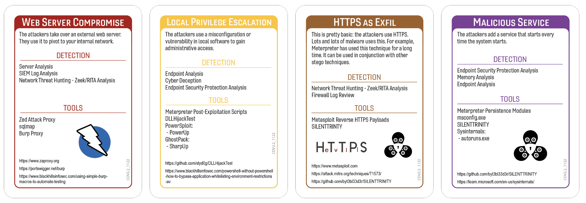
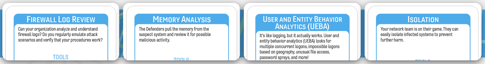

# That's Disputable
### Author: Ean Meyer - Black Hills Information Security
#### Campaign Template v1 - Campaign Version - 1.0

On May 12th, 2017 Equifax, one of the three major credit reporting bureaus, discovered they suffered a massive data breach disclosing 147.9 million Americans citizens, 15.2 British citizens, and 19,000 Canadian citizens credit reports. These reports contained PII (Personally Identifiable Information) including Social Security Numbers, Date of Birth, addresses, and much more. Credit Bureaus have an entire profile on most individuals to make determinations on credit worthiness. All the information needed to commit identity theft is kept in these reports. 

The breach was the result of a vulnerability in their Dispute Resolution Portal. This is a function of credit reporting services that allows someone to dispute something on their credit report. See a negative entry for never paying a card you didn't have or an open line of credit that isn't yours; file a dispute to remove it. The Equifax dispute portal ran on web servers using a vulnerable version of Apache Struts. The Apache Struts vulnerable was disclosed on 3/10/2017 as [CVE-2017-5638](https://nvd.nist.gov/vuln/detail/cve-2017-5638). This vulnerability along with a series of security issues allowed attackers to successfully steal data from Equifax. These security issues included internal communication failures regarding patching, political infighting around IT, and several high profile mistakes in the how they communicated with the public about the breach. This was documented in one of the most detailed breach reports ever made public. A United States Congressional investigation was launched to understand how such a massive disclosure of Americans sensitive information could occur. This [report](https://oversight.house.gov/wp-content/uploads/2018/12/Equifax-Report.pdf) is a must read for security professionals. 

In February of 2020 the Federal Bureau of Investigations charged Chinese Peoples Liberation Army (PLA) attackers with the breach of Equifax data. It's unlikely these attackers will ever face these charges. Further, attacks like this have become increasingly common: a nation-state backed military organization attacking large businesses in the United States. 
 
Equifax was compromised by nation-state backed attackers using a publicly disclosed major vulnerability on an Internet facing web server. Further, internal mismanagement slowed the response to the vulnerability and further 

Is your organization ready for an attack like this? Let's find out!

## Tags
Core Deck, Insider Threat, Cloud, Media Crisis

## Compatible Decks
Core v2.2

## Scenarios

### Initial Compromise

*Web Server Compromise*

The Equifax breach started with their Dispute Portal where a vulnerable version of Apache Struts [CVE-2017-5638](https://nvd.nist.gov/vuln/detail/cve-2017-5638) was exploited by attackers. The Dispute Portal is a service where people that believe there is an inaccuracy in their credit report can report it. Equifax investigates the report. If Equifax finds the report to be valid they remove the incorrect information from your credit report. The Apache Struts vulnerability on the web server allowed attackers to enter the Equifax servers and pivot deeper into the environment. [House Oversight Report - Page 31](https://oversight.house.gov/wp-content/uploads/2018/12/Equifax-Report.pdf)

### Pivot & Escalate

*Local Privilege Escalation*

Once attackers were inside the Equifax environment they were able to locate unencrypted passwords on systems. Attackers located a file share with unencrypted applications credentials stored in a configuration file database. [House Oversight Report - Page 32](https://oversight.house.gov/wp-content/uploads/2018/12/Equifax-Report.pdf) This file share was part of a legacy environment where access had not been appropriately limited. The credentials in the configuration database were unencrypted. Once located attackers were able to use credentials from the file to access the data that was eventually stolen via exfiltration. Access to the share, the unencrypted passwords, and a lack of systems/network segmentation were misconfigurations that allowed the attackers to further pivot into the Equifax environment and steal data. 

### C2 & Exfil

*HTTPS as Exfil*

The attackers were able to locate PII for close to 176 million (once the final tally was complete) individuals and exfiltrate it out of the Equifax systems. Exfiltration is the process of exiting the environment with data not meant to leave the environment via unauthorized means. They accomplished this theft by staging the PII data they located on a web server accessible to the Internet. The data was compressed to make it smaller for download and to potential further obfuscate the PII making it harder to detect the breach. Finally, attackers used WGET, a command line tool for downloading files/content/etc over HTTP and HTTPS. Once complete the attackers had achieved their Actions on Objective (The theft of the PII data). [House Oversight Report - Page 33](https://oversight.house.gov/wp-content/uploads/2018/12/Equifax-Report.pdf)

### Persistence

*Malicious Service*

The attackers used web shells to stay connected to the environment. Web shells are web based terminal applications that operate in a similar way to a command line terminal interface used by administrators of systems. Attackers configure them to run in the context of a web server service. Once configured on a web server with Internet access an attacker can use web shells to connect in a similar way as a legitimate system administrator. In the case of the Equifax breach 30 unique web shells were used to maintain access to the environment for 76 days before discovery. These web shells gave the attackers the ability to re-enter the systems at will after the initial compromise. [House Oversight Report - Page 32](https://oversight.house.gov/wp-content/uploads/2018/12/Equifax-Report.pdf)

## Procedures that Reveal the Attack Chain
The below Procedure Cards will reveal part of the attack chain in this scenario. This section can be used by the Incident Captain to quickly check if the card played would discover part of the attack chain. 

* Server Analysis
	* Initial Compromise - Web Server Compromise
* SIEM Log Analysis
	* Initial Compromise - Web Server Compromise
* Network Threat Hunting
	* Initial Compromise - Web Server Compromise
	* C2 & Exfil - HTTPS as Exfil
* Firewall Log Review
	* C2 & Exfil - HTTPS as Exfil
* Endpoint Analysis
	* Pivot & Escalate - Local Privilege Escalation
	* Persistence - Malicious Service
* Endpoint Security Protection Analysis
	* Pivot & Escalate - Local Privilege Escalation
	* Persistence - Malicious Service
* Cyber Deception
	* Pivot & Escalate - Local Privilege Escalation
* Memory Analysis
	* Persistence - Malicious Service
	

## Written Procedures
Below are the four written procedures the team playing will receive as part of the incident. These were chosen because they were specifically referenced in some public disclosure about the breach this campaign was based on. If there isn't any known reference to procedures used during the incident the campaign is based on two procedure cards that will discover some part of the attack chain will be chosen and two procedures that will not discover some part of the attack chain were chosen. For this campaign the below procedures will receive the +3 bonus per roll. As a general rule in campaign scenarios we select two established procedures that will discover part of the attack chain and two that will not for the +3 bonus.  

* Firewall Review
	* This procedure was included because it will discover the C2 & Exfil for this campaign. It was also chosen because during the Equifax breach inspection of encrypted traffic was offline for 19 months. An expired certificate that would have allowed for the SSL inspection appliance to look at the data was unable to see anything other than the encrypted stream of data from a server with existing Internet access. This would not be unusual, however, were the inspection configured properly, Equifax would potentially have seen the sensitive data leaving their environment. Services that do deep packet inspection are often features of modern next generation firewalls. [House Oversight Report - Page 32 and 33](https://oversight.house.gov/wp-content/uploads/2018/12/Equifax-Report.pdf)

* Memory Analysis
	* This was included because it will discover the Persistence for this campaign. It was also chosen because the Equifax attackers had 30 different web shells running in the environment. Memory analysis of servers transmitting data discovered after the SSL inspection was corrected would have found the web shells running in memory. Discovering these web shells will allow them to located, terminated, and removed from the system. This would effectively cut off the attackers alternate entry points back into the environment.  

* User and Entity Behavior Analytics (UEBA)
	* This card was included because it does not discover any items in the attack chain. Just like in real life, just because you're good at something, doesn't mean it will help you. In the case of the Equifax breach UEBA would have been of little use. Attackers were using good credentials for services expected to connect to other servers and databases. The attackers found these credentials in an unencrypted configuration database once they completed the Initial Compromise of the Equifax systems. The connected via the Disputes Portal which is used by people all over the world. Further, the exfiltration happened on a server with Internet access all while deep packet inspection of HTTPS connections was unavailable due to an expired cert. The combination of these issues means there were limited behaviors that could have been detected by UEBA. 

* Isolation
	* This card was included because it does not discover any items in the attack chain. Just like in real life, just because you're good at something, doesn't mean it will help you. Isolating the systems and taking the dispute portal offline was done during the Equifax breach, but this was only after discovery. At that point the attackers had operated within the environment for 76 days. Although the team was able to stop further data and compromise the majority of the damage was already done. Further, they had 30 web shells running allowing for re-entry. It's unlikely that isolating the ones they were able to discover would have found them all. As soon as an attacker discover their web shells being taken offline they likely would have changed their TTPs (Tactics, Techniques, and Procedures) pivoting to different servers or persistence methods. Because of this Isolation is not a procedure that would discover any part of the attack chain in this scenario. 
	
	 
## Procedure Success

When the team chooses a Procedure that would reveal part of the attack chain and rolls successfully the Incident Captain needs to explain what they discovered and why. Below are examples that may be used to describe why a procedure was successful and how the revealed part of the attack relates to the scenario. 

* Server Analysis
	* *Initial Compromise* - Upon reviewing the systems found to be have unusual traffic the team found several issues. One of the web servers with Internet facing access was using a vulnerable library to deliver the application. This library not only has a critical vulnerability allowing for total control of the server, but was a vulnerability with known patching disclosed for several months. The server somehow remained unpatched. Attackers leveraged this to achieve the Initial Compromise for the environment. 
	
* SIEM Log Analysis
	* *Initial Compromise* - The team reviewed the logs for the SIEM and noticed logs indicating unusual connections to China from one of the web servers. This web server has Internet facing access was using a vulnerable library to deliver the application. This library not only has a critical vulnerability allowing for total control of the server, but was a vulnerability with known patching disclosed for several months. The server somehow remained unpatched. Attackers leveraged this to achieve the Initial Compromise for the environment. 

* Network Threat Hunting
	* *Initial Compromise* - The began a network threat hunt and discovered unusual connections to China from one of the web servers. This web server has Internet facing access was using a vulnerable library to deliver the application. This library not only has a critical vulnerability allowing for total control of the server, but was a vulnerability with known patching disclosed for several months. The server somehow remained unpatched. Attackers leveraged this to achieve the Initial Compromise for the environment.
	* *C2 and Exfil* - The threat hunt team reviewed packet captures on traffic leaving the environment to unusual locations. One set of connections they reviewed 
	
* Firewall Log Review
	* *C2 & Exfil* - After reviewing the firewall logs incident responders found traffic leaving the environment from the dispute portal. A webshell inserted by the attackers in the disputes portal was located as the source of data flowing outbound through the firewalls.

* Endpoint Analysis
	* *Pivot & Escalate* - During the review of endpoint logging changes to the systems running the dispute portals showed logs revealing the installation of a webshell. The attackers used this webshell to maintain a presence on the system and pivot to other systems within the network. Further, this webshell was used to leverage the privilege the disputes portal had to access the entirety of the Equifax database. 
	* *Persistence* - After analyzing the endpoints connecting to the disputes portal a full trace was done of what queries are created and connections spawned when a user making standard requests via the system performs a task. This was compared to the activity seen on the server. After identifying the connections, software, and components that should be active a binary on the systems that was currently active and not related to any authorized process was discovered. This binary was the webshell used for persistence on the system. 

* Endpoint Security Protection Analysis
	* *Pivot & Escalate* - During the review of endpoint logging changes to the systems running the dispute portals showed logs revealing the installation of a webshell. The attackers used this webshell to maintain a presence on the system and pivot to other systems within the network. Further, this webshell was used to leverage the privilege the disputes portal had to access the entirety of the Equifax database. 
	* *NOTE* - This is the same description for Endpoint Analysis. The key difference between the two is Endpoint Analysis goes to the system using RDP, SSH, or physically to the device to review it. Endpoint Security Protection Analysis looks through the lens of tools on the system such as an EDR (Endpoint Detection and Response Tool). They often yield similar results while Endpoint Security Protection Analysis may have more tools to help you discover issues built in and Endpoint Analysis gives you more flexibility to check tools and processes as you aren't limited by the EDRs capabilities.

* Cyber Deception
	* *Pivot & Escalate* - You deployed a honeypot on the network and the attacker went after it. They saw a potentially vulnerable system they may be able to pivot to and gain additional privileges. Thankfully, this was your honeypot. The honeypot is a highly monitored system meant to slow the attacker down and gather information about how they operate, what tools they may use, and then gather that data to locate any areas they may have already compromised by using looking for the same Tactics, Techniques, and Procedures (TTPs) they utilized. You were able determine how the attacker like to pivot and escalate privilege, this allowed you to block these efforts elsewhere in the environment. 

* Memory Analysis
	* *Persistence* - After analyzing the memory on systems originally reported as exhibiting suspicious activity you found the presence of a webshell running in memory. This webshell is being used by the attackers to maintain access through a publicly facing system. This discovery allowed the team to disable this specific webshell and search the environment for the presence of the same webshell in an attempt to further cut off the attackers access.

## Procedure Failures
This section captures potential reasons why a control or procedure may fail. Below you will find general reasons for procedure failures related to the incident. You will also find specific reasons for a failure where a procedure card would discover part of the attack chain for the campaign. 

**General Reasons**

* Technical
	* "VarProcedure didn't detect anything because the attacker changed TTPs (Tactics, Techniques, Procedures)."
	* "VarProcedure didn't detect the attack because the agent or signatures are out of date."
	* "VarProcedure didn't detect the attack because the agent couldn't be deployed on the OS/Server/Laptop/Endpoint."
* Financial
	* "VarProcedure didn't work because the budget wasn't approved to expand licensing for tool/service/project/application to subsidiary/offices/datacenter/branch/new location/work from home/contractors."
	* "VarProcedure failed because the PO to renew the tool/service got stuck in the payment process. The tool/service stopped before someone noticed."
	* "VarProcedure couldn't identify any of the attack because the tool/service features that would have detected it were part of the more expensive package that wasn't purchased."
* Political
	* "VarProcedure wasn't configured at subsidiary/branch/business unit because Owner/VP/Senior Know-it-All/Project Manager said it would interfere with their CrItIcAl PrOjEcT timeline."
	* "VarProcedure found nothing because the project to deploy agent/service/tool/configuration was delayed until next fiscal year by the board."
	* "VarProcedure couldn't identify the attack because a member of the change board denied the change to deploy the service based on disagreements with the security team."
* Personel
	* "The only person that knows how to do/use VarProcedure is Casey and they're on vacation."
	* "The contractor hired to deploy VarProcedure ran out of hours in their contract."
	* "The team that manages VarProcedure is away at a conference."

**Procedure Failure Reasons**

Below are examples of failure reasons for the cards that would discover part of the attack chain in this procedure. Specific examples are given for the cards that would have discovered parts of the attack chain because these are often the hardest to think of during game play. Keep in mind a procedure that would discover part of the attack chain may fail, but later the same procedure used may discover part of the attack chain. Attackers may have changed their Tactics, Techniques, or Procedures. A team member may have thought of a new search query. Maybe everyone got some sleep and came back with fresh eyes? 
It shouldn't have failed, but it did, and the Incident Captain needs to give a contextually reasonable answer as to why. The below can help facilitate those more difficult responses during game play. 
	
* Server Analysis
	* Technical
		* "Analysts reviewed the server, but they have no baseline to compare it to. Nothing looks anomalous, but they don't have any historical or technical documentation around what this server should be doing. It's possible something is there, but right now they don't see it." 
	* Financial
		* "The server was slated to be upgraded, but the budget was cut. It's running a deprecated operating system the team has little familiarity with at this point. The older operating system is making it difficult to find malicious activity."  
	* Political
		* "The team that manages the server has a grudge with the security team over an audit. The security team doesn't have all the rights and permissions needed to do a proper investigation. This will need to be corrected first before a proper investigation can be completed." 
	* Personel
		* "Only one person knows how this server works and what normal looks like. They are on a plane traveling internationally and can't be contacted." 
* Memory Analysis
	* Technical
		* "The system doesn't have any remote forensic tools or connectivity that will let the security team install them. The system is also located in a data center the security team isn't physically near. Someone will need to go to that datacenter to install the tools before memory analysis can be completed successfully."
	* Financial
		* "The budget to hire a team member that really understood memory forensics and analysis was cut. The team can pull the memory and review it, but at the moment it's taking longer for them to figure out if there is something in the memory because they don't have the skill or training to do the proper analysis." 
	* Political
		* "The agents that do memory analysis for forensics were pulled when their installation crashed a critical set of systems. The IT leaders are pushing back on installing the tools again."
* Cyber Deception
	* Technical
		* "The attacker realized they were in a honeypot when they saw only one core on the server."
		* Note: *This is a common indicator to an attacker or malware they are on a sandbox or honeypot*
	* Financial
		*  "The executive team cut the line item for cyber deception projects. This wasn't just purchasing enterprise tools, but funding project hours to deploy even open source cyber deception tools. At this point the executive team is ready to deploy the tools if the Incident Response Team thinks it will help close the incident. Hopefully, they will be fully deployed if you try Cyber Deception again. 
	* Political
		* "A powerful VP in the organization opened a honey token in a file placed for attackers to find. They didn't like being investigated by the security team and leveraged HR to force the security team to remove honey tokens that may have discovered part of the attack chain. They are being redeployed now and may be able to detect something later."
	* Personel
		* "The only person that understands how and where all the cyber deception technologies are deployed is on FMLA because they just had a baby. Tokens and honeypots that should be writing logs that could discover the breach aren't seen. The Incident Response Team will dig through change controls to find all the deployments. Once found they may be able to find clues that discover part of the attack chain." 
* SIEM Log Analysis
	* Technical
		* "Connectors for the systems that would generate alerts weren't fully configured. The connection was tested, but checking if rules generated alerts that would be sent to the SIEM was not. The team is correcting this issue. Once corrected they may begin to see logs that reveal part of the attack chain." 
	* Financial 
		* "Additional licenses were needed to deploy to systems that came online after the original license purchase. The funding for these licenses was delayed until next quarter. The Incident Response Team was given approval to get the licenses and rapidly deploy them. Once deployed we may begin to see logs in the SIEM related to the attack chain." 
	* Political
		* "Infighting about who would own and manage the SIEM delayed deployment and configuration of functions that could have seen portions of the attack chain in logs. Management has cleared these roadblocks to allow the IR team to setup alerting and logging that may capture information that reveals part of the attack chain, but this will have to wait until we can look at the SIEM again." 
	* Personel
		* "The best threat hunter on your team is on vacation. They are an avid scuba diver that regularly travels to scuba camps on islands with little or no mobile phone reception. The Incident Response Team is doing their best to search the SIEM, but they aren't finding anything that would give clues about the attack chain yet. Give them time and maybe when we can look at the SIEM again."
* Network Threat Hunting
	* Technical
		* Your threat hunters are hunting, but they discovered many of the logs they would like to review and network segments they want to look at live are unavailable to them. An Emergency Change was put in to get them logs and access they need, but it will take some time to configure. When we come back to threat hunting they may be more successful. 
	* Financial
		*  The project to configure telemetry used by the threat hunters to find active breaches on the network was scraped in this years budget. They're trying their best with the tools and access they have, but aren't finding anything that would reveal the attack chain yet. Management approved any tools or changes they need to speed up the process. Hopefully when we try threat hunting again they will see something that reveals the attack chain. 
	* Political
		* A board member was identified as an insider threat by one of the threat hunters. However, this one done in error. The threat hunter was justified in their analysis, but the board member was authorized perform the actions the threat hunter identified as a possible threat actor. The board member took this personally and asked for an investigation into how we perform threat hunting on the network before any other threat hunts are performed. This delayed the threat hunting process being part of daily operations. The threat hunters were given permission to start aggressively searching systems, but it will take them time to find anything. Hopefully they will find something the next time we try this procedure. 
	* Personel
		* Your Lead Threat Hunter is on a plane traveling to another country to work on another potential breach at a datacenter where they must be onsite to perform the work. They will not see any messages or be able to perform any work for another eight hours. Hopefully when they land they can help the next time we try this procedure. 
* Firewall Log Review
	* Technical
		* The logging levels needed to identify the attack were configured to rollover every three days. The firewall will be reconfigured to capture logs on off device long term storage. Unfortunately, the logs that could reveal part of the attack chain are no longer available. Hopefully when we look at the logs again later and the attacker may leave a clue that will reveal part of the attack chain. 
	* Financial
		* Firewall logging functions were overwhelming performance so the level of detail captured per connection was reduced. This problem was to be corrected with the purchase of newer modern firewalls this quarter. Unfortunately, this line item was cut from the budget. The Executives expedited the purchase of an upgraded firewall and professional services to install it based on the breach. Hopefully by the next time we look at the procedure again the firewall will be installed and configured. At that point firewall logs may reveal part of the attack chain.  
	* Political
		* Deployment of firewalls on specific network segments caused an outage for part of the business. Executives from business units impacted demanded a full after action review and only once they were satisfied this would not happen again were the firewalls approved for redeployment. This is happening now. Hopefully by the next time we try this procedure they will be enabled. 
	* Personel
		* Your firewall engineer is at a training event in a hotel conference room with zero phone reception and no public Internet service. They cannot be reached to give the Incident Response Team access to the look at firewall configuration. They will call back on their break. Hopefully the next time we look at the firewall review they will have granted access to the Incident Response Team that will allow them to reveal part of the attack chain. 
* Endpoint Protection Analysis
	* Technical
		* The logs locally on the system were wiped. The Incident Response Team hardened the system to prevent this moving forward. Hopefully the next time we look at this procedure the attacker will perform an action on the local machine that creates a log revealing a clue about the attack chain. 
	* Financial 
		* The contractor hired to perform reviews and hardening of endpoints was released because the hardening project went over budget. The project wasn't completed and many systems aren't writing the logs needed for the Incident Response Team needs. This is being corrected now. Hopefully when you try the procedure again logs on the system will reveal something about the attack chain.
	* Political
		* When hardening was deployed to executive laptops it caused a lot of friction. The executives complained and asked for a full review of the deployed hardening to ensure it doesn't impact business operations. This left many systems unhardened and without appropriate logging. As part of the Incident Response hardening will be rapidly deployed. Hopefully, the next time we look at this procedure we will find information that shows part of the attack chain. 
	* Personel
		* The system needs to be physical inspected with hands on keyboard, but the closest person that can perform the work is several hours away by car. They've started driving, but it will take some time to get there. Once they will be able to look for clues about the attack chain. 
* Endpoint Security Protection Analysis
	* Technical
		* The agents that allow for remote inspection of endpoints hung after the last O/S update. The support team that manages endpoints is addressing the issue, but it will be a moment before the Incident Responders can look at the systems they need to review. The next time we try the procedure, hopefully, we will be able to connect to these systems and investigate. 
	* Financial 
		* When Endpoint Security Analysis was purchased a decision was made to only purchase agents for critical systems that process or store sensitive data. The attacker pivoted through systems that weren't configured for Endpoint Security Protection Analysis. The configuration changes are underway now to get this function online for these systems. The next time we try this procedure we may see clues about the attack chain. 
	* Political
		* An update to Endpoint Security Protection configuration or agents caused systems where this function is configured to go into a boot loop. The Change Committee denied changes to redeploy the function as they got in an argument with one of the IT leads about whether the issue would occur again. Management granted an Emergency Change Approval to reconfigure Endpoint Security Protection Analysis. The next time this procedure is used the team hopes some clues will be revealed about the attack.
	* Personel
		* The team member responsible for deploying the service never received proper training in configuration and did their best, but missed several key configurations. Further, they didn't have the skills to verify the procedure was accurate and complete or working as designed. The Incident Response Team is working with professional services to make the necessary changes. The goal is to potentially reveal some of the attack chain the next time we try the procedure. 

## Game Start

At the beginning of the game the Incident Captain shares how the team became aware of the incident:

"An analyst notices there is a significant increase in database queries from the primary production databases to a perimeter system accessible to the Internet. While investigating this they also find the connections are making larger requests than they would normally see from this system. This could be an upgrade or approved application change they weren't aware of or it could be something malicious. Your team gets a phone call because something seems off and they want you to investigate." What would you do first?

## Game Conclusion

At the end of the game the incident captain should walk through the incident. The below is a description of what happened:

*The attacker utilized a known vulnerability in the software package Apache Struts found on a web server used for credit disputes. Using this vulnerability they were able to query the main database and exfiltrate the data of every person in the database. This data include Personally Identifiable Information (PII) such as Social Security Numbers, Names, Birthdates, Addresses, Phone, and much more. The attacker was able to sit in your environment for months without detection because of internal communications issues that left the server unpatched. Eventually the server was successfully patched, but not before everything was stolen.*

This is similar to what we know about the Equifax breach where millions of credit records were stolen. The Equifax Disputes server that allows individuals to dispute issues with their credit record. This system should be limited to specific queries, however, the vulnerability allows attackers to make additional requests to the primary databases that allowed them to capture the data of every customer in the Equifax database. 

## Are you ready?

In this scenario we replicated a breach close to what Equifax suffered. Is your organization ready? Here are some of the key questions and takeaways you may examine to see if your organization is prepared:

* Do you have a proper and timely patching cycle? How do you know all the systems, especially public facing systems, are fully patched in a timely manner?
* Do you actively threat hunt on your network? The attack in this scenario went on for months; threat hunting may have discovered the threat actor before they were able to steal all Equifax's sensitive data. 
* Can you detect inappropriate database queries from systems making larger than normal or anomalous query types?

## References
The below are references to the incident this campaign was based on. These are included to give the Incident Captain additional context and background information before starting. They can also be given to the players after the fact to review as they research findings from the game and how those findings could impact their organization. 

* Massive Equifax data breach hits 143 million
	* [https://www.bbc.com/news/business-41192163](https://www.bbc.com/news/business-41192163)
* Equifax data breach FAQ: What happened, who was affected, what was the impact?
	* [https://www.csoonline.com/article/3444488/equifax-data-breach-faq-what-happened-who-was-affected-what-was-the-impact.html](https://www.csoonline.com/article/3444488/equifax-data-breach-faq-what-happened-who-was-affected-what-was-the-impact.html)
* Equifax Data Breach Settlement
	* [https://www.ftc.gov/enforcement/refunds/equifax-data-breach-settlement](https://www.ftc.gov/enforcement/refunds/equifax-data-breach-settlement)
* United States Congress - House Oversight Committee - Equifax Breach Report
	* [https://oversight.house.gov/wp-content/uploads/2018/12/Equifax-Report.pdf](https://oversight.house.gov/wp-content/uploads/2018/12/Equifax-Report.pdf)
* Chinese Military Hackers Charged in Equifax Breach
	* [https://www.fbi.gov/news/stories/chinese-hackers-charged-in-equifax-breach-021020](https://www.fbi.gov/news/stories/chinese-hackers-charged-in-equifax-breach-021020)
