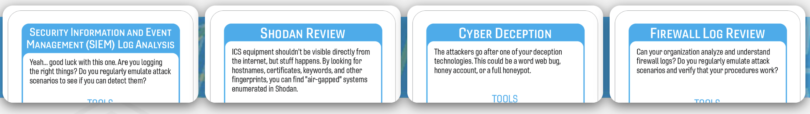

# Water Water Everywhere

A water treatment plant in Oldsmar, Florida suffered a breach in February of 2021. The breach led to software recommending the addition of a dangerous amount of sodium hydroxide to the water. This chemical is commonly used to regulate the PH of water. However, this is done with low levels of the chemical. High levels of the chemical can cause burns and skin damage. Thankfully, other safeguards caught this and the levels were adjusted to normal before harm was done. The breach was later found to be a caused remote access tool, TeamViewer, that was exposed to the Internet. The attacker used this remote management software to make changes to the management software controlling the water treatment systems. For this scenario we will use the Backdoors & Breaches ICS deck built in partnership with Dragos to present this breach and evaluate the procedures that could also be used to discover this attack and hopefully prevent future attacks like this in the future.

## Tags
ICS, Water, Water Treatment, PLC, SCADA, Remote Access, TeamViewer

## Compatible Decks
ICS OT Core Deck v1.1

## Scenarios

### Initial Compromise

*Dual Homed Device*

The Oldsmar Water Treatment Plant Breach started with a workstation running TeamViewer. TeamViewer is a remote management tool that is designed for administrators and support staff to remotely connect to a systems as if they are in front of the computer. This tool is often used by attackers as well. If left poorly configured with simple or no passwords to connect to the TeamViewer instance attackers can connect to the system and operate with whatever privileges the logged in session has. Further, if these systems are connected to the Internet attackers may discover the vulnerable TeamViewer instance and compromise it. This is essentially what occurred in this instance. An attacker found a vulnerable TeamViewer instance on a workstation that was able to connect to the water treatment system controls. The system and operator already had privileges to make changes. Because the attacker was connected through TeamViewer the system saw no difference between the legitimate user and the malicious one. This is one of the dangers of Dual Homed Devices. They may create a bridge between a network or set of systems with lower trust to one with systems that should have a higher level of protection such as the water treatment controls. 

### Pivot & Escalate

*Local Privilege Escalation*

The pivot in this scenario is from the Internet over TeamViewer to the water treatment controls that weren't connected to the Internet. The attacker moved from the Internet via TeamViewer to a workstation that had access to the water treatment controls that weren't visible to the attacker. This may not be a traditional escalation of privilege by a vulnerability, but it certainly is an escalation of privilege. By gaining access to a system where a logged in user had the privileges to make changes to the controls software the attacker was able to go from being an unauthenticated user on the Internet to the same level of privilege to the level of access a trusted engineer at the local controls would have.  

### C2 & Exfil

*Bridged System*

This scenario is interesting as the Actions On Objective for the attacker didn't have any exfiltration. Their goal was to make changes to the water treatment settings. Whether this was someone without an ulterior motive just poking around to see what they could do or a malicious actor attempting to do harm isn't currently known. However, either scenario is dangerous as real harm could have occurred. The bridging of the system doesn't occur in the traditional "two nics, one server" sense. The bridging occurred via the Team Viewer software and the workstation being connected to the Internet. The water treatment controls weren't connected to the Internet. However, this type of issue is seen often. Imagine you are a worker tasked with checking the values of systems that are often in remote areas. You've been told "we can't connect the controller to the Internet", but nothing stops you from installing TeamViewer that will allow you to connect to the workstation from the Internet that lets you connect to the water treatment controller. 

### Persistence

*Stolen Engineering Workstation Account*

This scenario doesn't necessarily steal the credentials of the workstation. However, there isn't a significant difference between them being stolen and being used. Because the compromised workstation had the access and authority to make changes to the water treatment controller this effectively allowed the attacker to work as if they had stolen the credentials. Until the water treatment plant both cycles the credentials of the workstation and user along with removing TeamViewer the attacker will maintain the ability to connect to the system. 

##Procedures that Reveal the Attack Chain
The below Procedure Cards will reveal part of the attack chain in this scenario. This section can be used by the Incident Captain to quickly check if the card played would discover part of the attack chain.

* SIEM Log Analysis
	* Initial Compromise - Dual Homed Device
	* C2 and Exfil - Bridged System
* Shodan Review
	* Initial Compromise - Dual Homed Device
* Endpoint Analysis
	* Initial Compromise - Dual Homed Device
	* Pivot and Escalate - Local Privilege Escalation 
* User and Entity Behavior Analytics (UEBA)
	* Initial Compromise - Dual Homed Device
	* Pivot and Escalate - Local Privilege Escalation
* Consequence Driven Threat Hunting
	* Pivot and Escalate - Local Privilege Escalation
	* Persistence - Stolen Engineering Workstation (EWS) Account
* Protocol Analysis
	* C2 and Exfil - Bridged System
* Memory Analysis
	* Persistence - Stolen Engineering Workstation (EWS)

## Written Procedures
Below are the four written procedures the team playing will receive as part of the incident. These were chosen because they were specifically referenced in some public disclosure about the breach this campaign was based on. If there isn't any known reference to procedures used during the incident the campaign is based on two procedure cards that will discover some part of the attack chain will be chosen and two procedures that will not discover some part of the attack chain were chosen. For this campaign the below procedures will receive the +3 bonus per roll. As a general rule in campaign scenarios we select two established procedures that will discover part of the attack chain and two that will not for the +3 bonus.  

* SIEM Analysis
	* This procedure was included because proper SIEM logging could have detected many of the issues that resulted in the unauthorized access at the Oldsmar water treatment plant. TeamViewer was installed on a workstation that was either used as an Engineering Workstation (EWS) or could connect to an EWS. This was likely added at some point to allow workers to check levels remotely. Whether this was authorized or not is not known. However, proper SIEM logging could detect this in several ways: Alerts for TeamViewer Binaries fed from security tools on Endpoints, Installation or running binary logs sent from the endpoint to the SIEM, Firewall logs showing connectivity to TeamViewer servers or clients, unusual traffic patterns on the perimeter firewalls, etc. All these items could be correlated by a SIEM to produce a high fidelity alert showing unauthorized activity.
	
* Shodan Analysis
	* This procedure was included as it is a very likely vector for how the attacker discovered the TeamViewer presence on the workstation. Shodan captures a listing of all the public facing IPs and ports with listening services on the Internet. An attacker may have seen the TeamViewer instance via Shodan and tried common passwords, passwords from breach dumps, used a vulnerability, or used a bypass to gain access to the instance. Shodan Analysis could find these exposed systems in advance before attackers are able to compromise the vulnerable TeamViewer instances. 

* Cyber Deception 
	* **Note** - *This procedure falls into the category of the meme "Task Failed Successfully". It's included as a written procedure, but it will not reveal any of the attack chain. These are included because it's important to remember that even though your team may be incredibly good at one part of security, it doesn't mean that part will help. This is designed to create conversation around how to balance your teams skills to ensure you have the appropriate coverage in areas you may need during an incident.* 
	* In the case of this card deploying cyber deception technologies won't discover any of the attack change because the attacker during the Oldsmar breach didn't exhibit any sophisticated behaviors. It's possible they simply got lucky, connected to TeamViewer, and turned some dials on the EWS. They may not have known how to pivot to a honeypot from their location. In the case of this incident the attacker was discovered while using TeamViewer and stopped. Because of this they would have never had a chance to pivot to a honeypot even if they had the skills to do so. 

* Firewall Log Review
	* **Note** - *This procedure falls into the category of the meme "Task Failed Successfully". It's included as a written procedure, but it will not reveal any of the attack chain. These are included because it's important to remember that even though your team may be incredibly good at one part of security, it doesn't mean that part will help. This is designed to create conversation around how to balance your teams skills to ensure you have the appropriate coverage in areas you may need during an incident.*
	* In the case of Firewall Log Review it would seem like access via TeamViewer would be easy to spot, but that isn't always the case. TeamViewer is often used as a "phone home" tool that checks for people wanting to connect. If the outbound firewall connections for the water treatment plant aren't monitored the firewall analysis may not turn up any major anomalies. Further, if TeamViewer was deployed in a semi-authorized way, meaning everyone knows it's used, but no one ever validated the security or what authorized use looks like these connections could be missed. If TeamViewer is used often in an "authorized" way by the team in the water treatment plant seeing TeamViewer connections in the firewall would not necessarily raise any alarms. 

## Procedure Success

When the team chooses a Procedure that would reveal part of the attack chain and rolls successfully the Incident Captain needs to explain what they discovered and why. Below are examples that may be used to describe why a procedure was successful and how the revealed part of the attack relates to the scenario. 

* SIEM Log Analysis
	* *Initial Compromise* - After reviewing SIEM logs the team finds an unexplained and potentially unauthorized installation of TeamViewer. This was found by correlating logs from installations on the Endpoint with other logging data in the SIEM. This allowed the team to locate the initial compromise as they investigated why TeamViewer is on a system connected to a network that has access to operational technologies.
	* *C2 and Exfil* - While looking at internal netflow logs sent to the SIEM the team finds connections between a laptop and an Engineering Workstation. In this case data isn't being exfiltrated, but TeamViewer is being used for control. This leads the team to examine the connection between these systems further. This reveals the bridged system is allowing control of the water treatment system via TeamViewer from the Internet.
* Shodan Review
	* *Initial Compromise* - The team decides to look at the network range for the water treatment plant on Shodan. They find a number of IPs and Ports exposed to the Internet they weren't previously aware of. This includes the source of the incident, a laptop running TeamViewer. The team is able to locate the laptop and begin investigation revealing the Initial Compromise.
* Endpoint Analysis
	* *Initial Compromise* - The operator noticed the mouse on their laptop was moving erratically before it began attempting to open items on their laptop. The team asked to review the laptop and found TeamViewer installed. This led them to discover the initial compromise as TeamViewer was used to make the changes on the water treatment systems. 
	* *Pivot and Escalate* -  Upon reviewing the endpoint the team found the changes were made during hours the system operator would not be onsite. This led them to investigate how these changes were made. They discovered a laptop was placed in the facility to allow the technicians to remotely connect to the laptop which could intern connect locally to the water treatment systems. The reasoning was to allow the technicians to check on alerts and levels remotely during off hours and weekends. However, it wasn't deployed with any security review. As such the operator was logged into the EWS with their credentials. Connecting via TeamViewer essentially allowed the attacker to pivot to the water treatment system and use the operators privileges as their own. 
* User and Entity Behavior Analytics (UEBA)
	* *Initial Compromise* - The team reviewed logging from their UEBA system and noticed the changes were made to the system by an operator when they would not have been in the facility. This was detected by the UEBA as unusual as no one ever connects to the system at these hours. Although this could be an authorized activity, the anomaly requires investigation. Once the team looks closer they find the reason the changes were made off hours is an attacker was leveraging TeamViewer which had access to a system with the water treatment controls. That system was logged in as the site operator. The logging in UEBA showed they connected and performed actions at an unusual time for them. This led the team to find the TeamViewer instance and reveal the Initial Compromise. 
	* *Pivot and Escalate* - **Note** - *This is largely the same as revealing the initial compromise with UEBA above. When you successfully use a procedure that would reveal two cards sometimes the reasons are highly related. As an Incident Captain you will need to choose which card to reveal instead of revealing both. Later when the card is revealed if someone asks why both cards weren't revealed you may use the following example: Just like in the real world when you are looking for your car keys, once you find them, you don't keep looking for them. During an investigation when you find something everyone latches onto it and goes to their systems to see what this new information reveals. It's possible the team would not see the next piece of evidence that would reveal this part of the attack chain until the return to the procedure again to take another look. Also, the attacker may change their TTPs (Tactics, Techniques, and Procedures) during the attack. When you looked at the procedure previously the attacker may not have taken actions that would trigger the procedure to capture information or alert. When you go back later they may have changed TTPs allowing for the team to reveal this card.* 
	* The team reviewed logging from their UEBA system and noticed a privileged user making changes to a water treatment system at unusual times. This was detected by the UEBA as unusual this operator was not scheduled to work when the changes were made. Although this could be an authorized activity, the anomaly requires investigation. Once the team looks closer they find the reason the changes were made off hours is an attacker was leveraging TeamViewer which had access to a system with the water treatment controls. That system was logged in as the site operator. The logging in UEBA showed they connected and performed actions at an unusual time for them. This led the team to find the TeamViewer instance and reveal the Initial Compromise. 
* Consequence Driven Threat Hunting
	* *Pivot and Escalate* - The team performed a Consequence Driven Threat Hunt by looking at all the dependent systems and access that would be needed to make changes to the water treatment system controls. This investigation located every system, user, process, and technology that would have the ability to make changes that could adversely affect the water treatment system. This threat hunt mapped these systems and activities. It found a privileged user remained logged in to the water treatment controls. This led to the discover this same user account was responsible for the changes. Tracking this what was connected to the water treatment system led the team back to the laptop with TeamViewer. The logged in user and the laptop with TeamViewer allowed the attacker to pivot to the water system controls and leverage the engineers logged in credentials. 
	* *Persistence* - **NOTE** *This is largely the same as revealing the Pivot and Escalate with Consequence Driven Threat Hunting above. When you successfully use a procedure that would reveal two cards sometimes the reasons are highly related. As an Incident Captain you will need to choose which card to reveal instead of revealing both. Later when the card is revealed if someone asks why both cards weren't revealed you may use the following example: Just like in the real world when you are looking for your car keys, once you find them, you don't keep looking for them. During an investigation when you find something everyone latches onto it and goes to their systems to see what this new information reveals. It's possible the team would not see the next piece of evidence that would reveal this part of the attack chain until the return to the procedure again to take another look. Also, the attacker may change their TTPs (Tactics, Techniques, and Procedures) during the attack. When you looked at the procedure previously the attacker may not have taken actions that would trigger the procedure to capture information or alert. When you go back later they may have changed TTPs allowing for the team to reveal this card.* 
	* The team performed a Consequence Driven Threat Hunt by looking at all the dependent systems and access that would be needed to make changes to the water treatment system controls. This investigation located every system, user, process, and technology that would have the ability to make changes that could adversely affect the water treatment system. This threat hunt mapped these systems and activities. Tracking this led the team back to the laptop with TeamViewer. The logged in user and the laptop with TeamViewer allowed the attacker to maintain remote persistence as a privileged user. 
* Protocol Analysis
	* *C2 and Exfil* - The team took a look at the network traffic connected to the affected water treatment system and found several active connections. Upon examining the protocols used for these connections they discovered the connection was TeamViewer traffic back to a laptop in the facility. This allowed the team to track the laptop down and locate the source of the attackers control: TeamViewer. 
* Memory Analysis
	* *Persistence* - The team reviewed a forensic dump of the memory on laptop used by the engineer. They TeamViewer running on the system. This led them to investigate further discovering this TeamViewer instance was used to connect to the facility from the outside and the same laptop was connected to a network segment that allowed it to reach the controls for the water treatment system. 

## Procedure Failures
This section captures potential reasons why a control or procedure may fail. Below you will find general reasons for procedure failures related to the incident. You will also find specific reasons for a failure where a procedure card would discover part of the attack chain for the campaign. 

**General Reasons**

* Technical
	* "VarProcedure didn't detect anything because the attacker changed TTPs (Tactics, Techniques, Procedures)."
	* "VarProcedure didn't detect the attack because the agent or signatures are out of date."
	* "VarProcedure didn't detect the attack because the agent couldn't be deployed on the OS/Server/Laptop/Endpoint."
* Financial
	* "VarProcedure didn't work because the budget wasn't approved to expand licensing for tool/service/project/application to subsidiary/offices/datacenter/branch/new location/work from home/contractors."
	* "VarProcedure failed because the PO to renew the tool/service got stuck in the payment process. The tool/service stopped before someone noticed."
	* "VarProcedure couldn't identify any of the attack because the tool/service features that would have detected it were part of the more expensive package that wasn't purchased."
* Political
	* "VarProcedure wasn't configured at subsidiary/branch/business unit because Owner/VP/Senior Know-it-All/Project Manager said it would interfere with their CrItIcAl PrOjEcT timeline."
	* "VarProcedure found nothing because the project to deploy agent/service/tool/configuration was delayed until next fiscal year by the board."
	* "VarProcedure couldn't identify the attack because a member of the change board denied the change to deploy the service based on disagreements with the security team."
* Personnel
	* "The only person that knows how to do/use VarProcedure is Casey and they're on vacation."
	* "The contractor hired to deploy VarProcedure ran out of hours in their contract."
	* "The team that manages VarProcedure is away at a conference."

**Procedure Failure Reasons**

Below are examples of failure reasons for the cards that would discover part of the attack chain in this procedure. Specific examples are given for the cards that would have discovered parts of the attack chain because these are often the hardest to think of during game play. Keep in mind a procedure that would discover part of the attack chain may fail, but later the same procedure used may discover part of the attack chain. Attackers may have changed their Tactics, Techniques, or Procedures. A team member may have thought of a new search query. Maybe everyone got some sleep and came back with fresh eyes? 
It shouldn't have failed, but it did, and the Incident Captain needs to give a contextually reasonable answer as to why. The below can help facilitate those more difficult responses during game play. 

* SIEM Log Analysis
	* Technical
		* "Connectors for the systems that would generate alerts weren't fully configured. The connection was tested, but checking if rules generated alerts that would be sent to the SIEM was not. The team is correcting this issue. Once corrected they may begin to see logs that reveal part of the attack chain." 
	* Financial 
		* "Additional licenses were needed to deploy to systems that came online after the original license purchase. The funding for these licenses was delayed until next quarter. The Incident Response Team was given approval to get the licenses and rapidly deploy them. Once deployed we may begin to see logs in the SIEM related to the attack chain." 
	* Political
		* "Infighting about who would own and manage the SIEM delayed deployment and configuration of functions that could have seen portions of the attack chain in logs. Management has cleared these roadblocks to allow the IR team to setup alerting and logging that may capture information that reveals part of the attack chain, but this will have to wait until we can look at the SIEM again." 
	* Personnel 
		* "The best threat hunter on your team is on vacation. They are an avid scuba diver that regularly travels to scuba camps on islands with little or no mobile phone reception. The Incident Response Team is doing their best to search the SIEM, but they aren't finding anything that would give clues about the attack chain yet. Give them time and maybe when we can look at the SIEM again."
* Shodan Review
	* Technical
		* "The team checked Shodan to see if there were any additional ports open. Unfortunately, they only looked for external ranges listed in the approved network documentation. Nothing was found because someone added a network device that was able to acquire an additional IP from the ISP. That IP address and range was shown to be exposed on Shodan, but the team was unaware it was an IP and range they should be searching for."
	* Financial
		* "The team was not given the budget to perform an onsite review of all the IPs that could be assigned by the ISPs at facilities to see if any rogue network devices were added. This was budgeted for next year. Because of this the team was unaware additional IP ranges were online that required investigation. These IPs would have been seen in Shodan and acted on if the team was aware of them."
	* Political
		* "When the security team proposed reviewing all IP traffic for all locations with direct Internet access the network team stated they were in the middle of a massive network overhaul. Leadership delayed this review as it would be a 'waste of time when everything is going to change anyway'. This review would have discovered additional network ranges that could be used during a Shodan review. Unfortunately, the team did not reveal anything based on what they know about the external network footprint.
	* Personnel 
		* "The team member who is extremely proficient at using the Shodan API to map the externally facing IP ranges into a file that can be compared to possibly impacted systems is on vacation and out of mobile phone range. The team struggles with the web interface and finds nothing. This doesn't mean this procedure proved there are no systems listed on Shodan, only that the team could not locate them." 
* Endpoint Protection Analysis
	* Technical
		* The logs locally on the system were wiped. The Incident Response Team hardened the system to prevent this moving forward. Hopefully the next time we look at this procedure the attacker will perform an action on the local machine that creates a log revealing a clue about the attack chain. 
	* Financial 
		* The contractor hired to perform reviews and hardening of endpoints was released because the hardening project went over budget. The project wasn't completed and many systems aren't writing the logs needed for the Incident Response Team needs. This is being corrected now. Hopefully when you try the procedure again logs on the system will reveal something about the attack chain.
	* Political
		* When hardening was deployed to executive laptops it caused a lot of friction. The executives complained and asked for a full review of the deployed hardening to ensure it doesn't impact business operations. This left many systems unhardened and without appropriate logging. As part of the Incident Response hardening will be rapidly deployed. Hopefully, the next time we look at this procedure we will find information that shows part of the attack chain. 
	* Personnel
		* The system needs to be physical inspected with hands on keyboard, but the closest person that can perform the work is several hours away by car. They've started driving, but it will take some time to get there. Once they will be able to look for clues about the attack chain. 
* UEBA (User and Entity Behavior Analytics)
	* Technical
		* "UEBA was deployed, but it doesn't look like the attacker performed any behaviors that are detected by the rules engine. They may change tactics or we can look at rules tuning later." 
	* Financial
		* "The module that integrates the companies cloud environment to end-point analysis was an add-on that took the UEBA purchase over budget. Without budget the module wasn't installed."  
	* Political
		* "One division of the company experienced a work outage when UEBA was installed. It blocked team members from performing normal job tasks. The leader of that division blocked further rollout on the systems where UEBA could have detected the attack. Before we revisit this we can put in a change to deploy to those systems." 
	* Personnel
		* "Only one person knows how to tune the UEBA rules and is completely unavailable. The team tried to tune the rules, but weren't able to detect any part of the attack chain yet. Before we come back to this procedure the team may contact vendor support or enlist professional services to tune the alerts."
* Consequence Driven Threat Hunting
	* Technical
		* "The team attempts a Consequence Driven Threat Hunt by using the documentation made available to them as to how, where, when, and why critical systems connect to each other. Unfortunately, that documentation was lacking several dependencies and impact analysis for those systems. The team realized this during the review. When they searched further they were unable to find the connectivity that would reveal part of the attack chain because the attackers were not performing any actions or connections that would be suspicious at the time of the threat hunt." 
	* Financial
		* "The project to map the network connectivity, system dependancies, account privilege reviews, and impact analysis if any of these were to be leveraged in a breach was delayed. Leadership stated several new projects budgeted for next year would completely change how these systems are managed. As such spending time building this documentation would be a waste because the new system is 'self-documenting' or at least that is what the vendor assured them. The team gets slowed down by this and the threat hunt doesn't yield any results." 
	* Political
		* "Certain members of leadership are concerned about running a Consequence Driven Threat Hunt at this time. The last time a penetration test was run it caused some operational system outages. They aren't able to separate the actions of a penetration test from a threat hunt and delay the hunt while other leadership attempts to sway them. This delay means although the threat hunt would have been successful discovering items, the team wasn't allowed to run it in a timely manner. 
	* Personnel
		* "The person that knows how the entire system works, what happens when parts don't work, what can go wrong, and where all the issues no one talks about are retired yesterday. They were your subject matter expert to help enable your threat hunt. With this team member Consequence Driven Threat Hunts were a strong tool in your arsenal. Without them the team has the tools and the documentation, but is mostly 'groping in the dark'. The team performed the hunt successfully, but without the newly retired expert, they missed items that may have revealed part of the attack chain.  
* Protocol Analysis
	* Technical
		* "The team can see the protocol being used on the network, but it's encapsulated so they cannot review what data is sent. Unfortunately, it looks like there is a TLS wrapper around the protocol and the site where the connection originates from does not have TLS inspection or a proxy enabled. The team can see the connection, but cannot see what it's doing." 
	* Financial
		* "A project to place a proxy or another TLS inspection tool like an IDS/IPS at the location was delayed due to budget cuts. The team can see a protocol connecting, but they can't inspect it on the network because it's encrypted. Unfortunately, you can see the connection, you are unable to reveal anything else about it." 
	* Political
		* "The team that supports the network segment where protocol analysis functions would occur is pushing back on connecting any security tools to operational networks. Previously the configuration of network segmentation request by the security team caused several major issues. They want a meeting to explain what these tools will do and what impact they may have before allowing anyone to connect to the Operational Technology network. This delay limited the teams ability to search in a timely manner. Once they were able to connect the system was no longer sending the network traffic that would have led to discovering part of the attack chain." 
	* Personnel
		* Your expert on protocol analysis left a playbook, but they are out of the country. The team attempts to follow the playbook, but without the years of experience this team member has the work is slow and the team misses the traffic that would reveal potential issues. 
* Memory Analysis
	* Technical
		* "The system doesn't have any remote forensic tools or connectivity that will let the security team install them. The system is also located in a data center the security team isn't physically near. Someone will need to go to that datacenter to install the tools before memory analysis can be completed successfully."
	* Financial
		* "The budget to hire a team member that really understood memory forensics and analysis was cut. The team can pull the memory and review it, but at the moment it's taking longer for them to figure out if there is something in the memory because they don't have the skill or training to do the proper analysis." 
	* Political
		* "The agents that do memory analysis for forensics were pulled when their installation crashed a critical set of systems. The IT leaders are pushing back on installing the tools again."

## Game Start

At the beginning of the game the Incident Captain shares how the team became aware of the incident:

"The security team receives a phone call because a laptop used by an Engineer at one of your water treatment sites is behaving strangely. They said they were working and saw the mouse move erratically and then try and open some applications. They've never seen this happen before. They grabbed the mouse and it stopped. They're calling you because they think there may be a virus or something else going on. They want the security team to check it out."

This begging is based on what we know about the Oldsmar Water Treatment Facility Breach in Florida. The Engineer saw their mouse moving and started investigating why. In this case they were led to changes in the water treatment system that could have caused major issues, however, they were caught before any harm was done. This scenario should help players think through their ICS/OT controls to determine how they would detected a rogue laptop, TeamViewer, and identify if/how an attacker may have done more. 

## Are you ready?

In this scenario we replicated a breach close to what Equifax suffered. Is your organization ready? Here are some of the key questions and takeaways you may examine to see if your organization is prepared:

* Do you know all the devices on your network?
* Can you identify potential unapproved assets like a laptop on the network?
* Can you identify unapproved software used on assets connected to your network? E.G. - TeamViewer? Other Remote Management Tools?
* Can you detect activity that would be anomalous for privileged users?
* Can you detect systems bridging your OT and Non-OT networks?

## References

* Wired.com - Oldsmar Florida Water Utility Hack
	* https://www.wired.com/story/oldsmar-florida-water-utility-hack/
* Threatpost.com - Florida Water Plant Hack: Leaked Credentials Found in Breach Database
	* https://threatpost.com/florida-water-plant-hack-credentials-breach/163919/
* Dragos - Recommendations Following the Oldsmar Water Treatment Facility Cyber Attack
	* https://www.dragos.com/blog/industry-news/recommendations-following-the-oldsmar-water-treatment-facility-cyber-attack/
